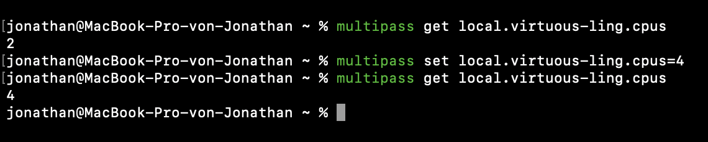
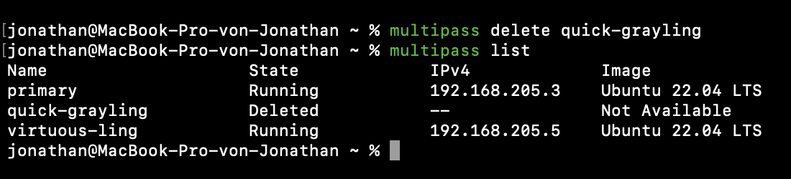

# KN01: Virtualisierung

## Erstellen einer virtuellen Maschine mit Multipass

Im folgenden Bild sieht man, dass beide Instanzen erstellt wurden und gerade am laufen sind. Durch einen einfachen Rechtsklick auf das Menü Icon von Multipass kommt dann dieses Kontexmenü.

Auch im Terminal kann man mittels dem Befehl `multipass list` die aktuell laufenden Instanzen sehen.

## Testen verschiedener Befehle

### Starten und Stoppen einer Instanz

Mit dem Befehl `multipass start <name>` kann eine Instanz gestartet werden. Mit dem Befehl `multipass stop <name>` kann eine Instanz gestoppt werden. In diesem Beispiel wird die Instanz `virtuous-ling` gestartet und gestoppt.

### Ändern der Anzahl CPU Kerne

Mit dem Befehl `multipass set local.<name>.cpus=<anzahl>` kann die Anzahl der CPU Kerne geändert werden. In diesem Beispiel wird die Anzahl der CPU Kerne auf 4 erhöht. Mit `multipass get local.<name>.cpus` kann man dann wieder die aktuelle Anzahl der CPU Kerne abfragen.

### Shell der Instanz öffnen

Mit dem Befehl `multipass shell <name>` kann man sich in die Shell der Instanz einloggen.

### Instanz löschen

Mit dem Befehl `multipass delete <name>` kann eine Instanz gelöscht werden.

Damit sie aber endgültig gelöscht wird, muss noch der parameter `--purge` oder auch `-p` angehängt werden. Also `multipass delete -p <name>`.

## Installation von Web- und Datenbankserver

### index.html

### info.php

## db.php

