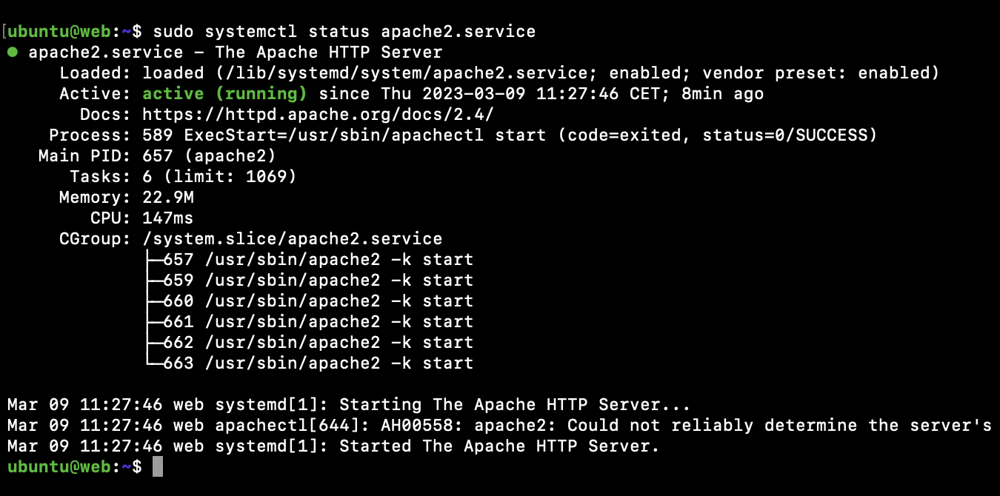
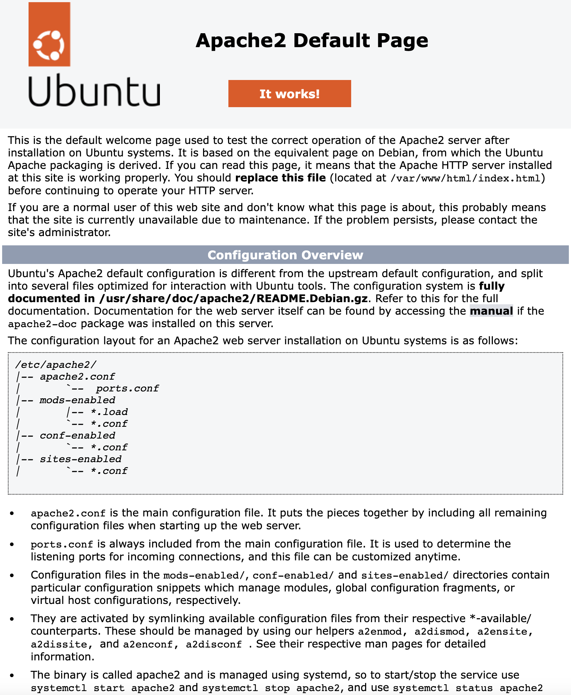

# KN02: Automatisierung / Cloud-init

## Cloud-init Datei

Hier eine Übersicht der kommentierten [cloud-init-web.yaml](cloud-init-web.yaml) Datei:

```yaml
#cloud-config
users: # Collection von Benutzern
  - name: ubuntu # Der Benutzername des ersten Benutzers
    sudo: ALL=(ALL) NOPASSWD:ALL # sudo-Regeln für diesen Benutzer
    groups: users, admin # Gruppen, in denen der Benutzer Mitglied ist
    home: /home/ubuntu # Home-Verzeichnis des Benutzers
    shell: /bin/bash # Shell des Benutzers
    lock_passwd: false # Passwort des Benutzers sperren
    plain_text_passwd: 'password' # Passwort des Benutzers
ssh_pwauth: true # Passwort-Authentifizierung für SSH aktivieren
disable_root: false # Root-Benutzer sperren
packages: # Pakete, die installiert werden sollen
  - apache2
  - curl
  - wget
  - php
  - libapache2-mod-php
  - php-mysqli
```

## Webserver starten

Um zu überprüfen, ob der Apache Service läuft, kann der Befehl `sudo systemctl status apache2.service` verwendet werden.



Es kann mithilfe der IP-Adresse der Instanz auch eine entsprechende Webseite aufgerufen werden.


