# AWS Kurs

## Lab 4.1 - EC2

### EC2 Instanz erstellen

Zuerst muss der EC2 Service ausgewählt werden. Dieser befindet sich unter dem Reiter "Compute" in der AWS Management Console. Nachdem der EC2 Service ausgewählt wurde, kann eine neue Instanz erstellt werden. Dazu muss der Reiter "Instanzen" ausgewählt werden.

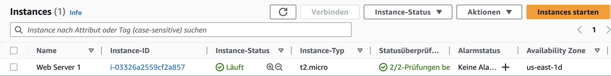

Die genauen Details zu einer Instanz können über den Reiter "Details" abgerufen werden. Hier sind unter anderem die öffentliche IP-Adresse, der Typ der Instanz, der Status und die Region zu finden.

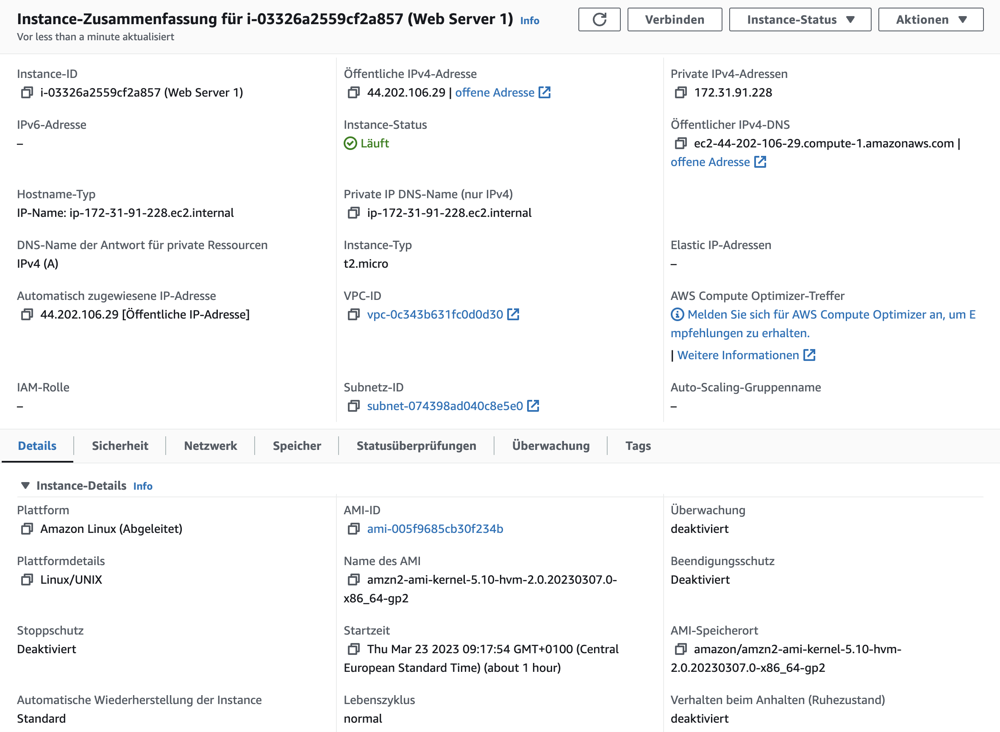

### Applikation und OS Images

Danach muss ein AMI (Amazon Machine Image) ausgewählt werden. Dieses beinhaltet die Applikation und das Betriebssystem, das auf der Instanz installiert werden soll. Für diesen Auftrage wird das AMI "Amazon Linux 2 AMI (HVM)" ausgewählt.

### Instanztyp

Als nächstes muss ein Instanztyp ausgewählt werden. Dieser bestimmt die Hardwarekonfiguration der Instanz. Für diesen Auftrag wird der Instanztyp "t2.micro" ausgewählt.

### Key Pair

Nun muss ein Key Pair ausgewählt werden. Dieses wird benötigt, um sich später auf der Instanz anzumelden. Hier kann entweder ein bestehendes Key Pair ausgewählt werden oder ein neues erstellt werden. Für diesen Auftrag wird das Key Pair "vockey" ausgewählt.

### Netzwerk Einstellungen

Jetzt können die Netzwerk Einstellungen für die Instanz festgelegt werden. Zunächst muss eine neue Security Group erstellt werden. Diese beinhaltet die Regeln, die für die Instanz gelten. Danach müssen noch die Inbound Rules für die Security Group festgelegt werden. Danach sollte die Security Group wie folgt aussehen:

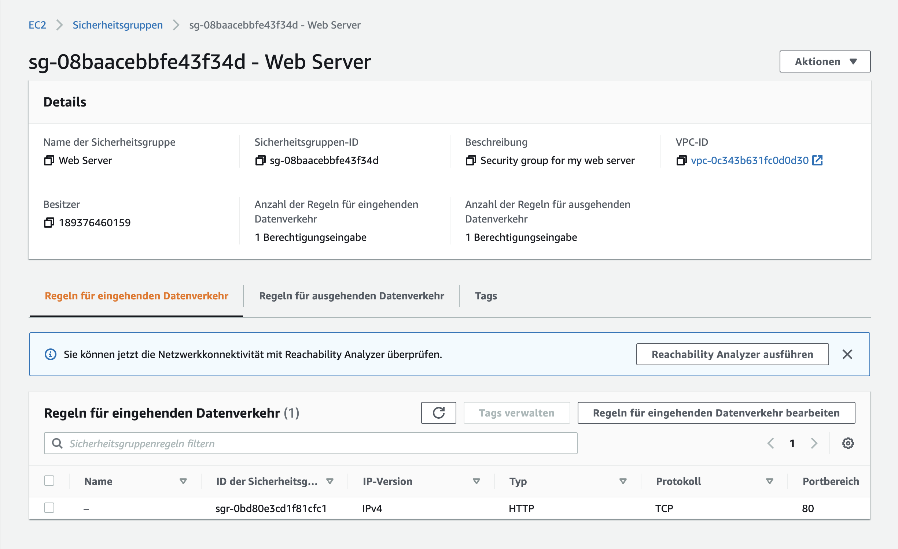

### Storage

Die Storage Einstellungen können nun festgelegt werden. Für diesen Auftrag wird ein 8 GiB grosse general purpose SSD (gp2) Festplatte ausgewählt.

### Erweiterte Details

Hier wird die HTML Seite aufgesetzt, die später auf der Instanz ausgeführt werden soll. Dazu muss zunächst der Reiter "User Data" ausgewählt werden. Danach muss der entsprechende Code in das Textfeld kopiert werden.

### Instanz reviewen und starten

Nun kann die HTML Seite mithilfe der öffentlichen IPv4-Adresse der Instanz aufgerufen werden. Die Webseite sollte nun angezeigt werden. Die Webseite beinhaltet lediglich eine kurze Begrüßung: "Hello World!".

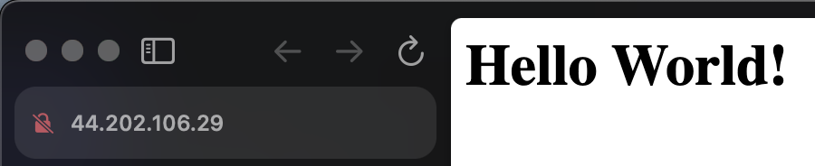

## Lab 4.2 - S3

### S3 Bucket erstellen

Um einen S3 Bucket zu erstellen, muss zunächst der S3 Service ausgewählt werden. Dieser befindet sich unter dem Reiter "Storage" in der AWS Management Console. Nachdem der Bucket erstellt wurde, kann dieser über den Reiter "Buckets" aufgerufen werden.

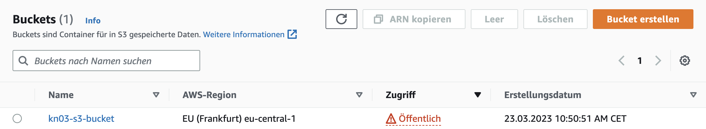

### Eine Bucket Policy erstellen, um den Bucket öffentlich zugänglich zu machen

Damit der Bucket öffentlich zugänglich ist, muss eine Bucket Policy erstellt werden. Diese Policy erlaubt den Zugriff auf den Bucket für alle Benutzer.

### Eine HTML Datei in den Bucket hochladen

Nachdem die Bucket Policy erstellt wurde, kann nun eine HTML Datei in den Bucket hochgeladen werden. Sie kann über den Reiter "Objekte" aufgerufen werden.

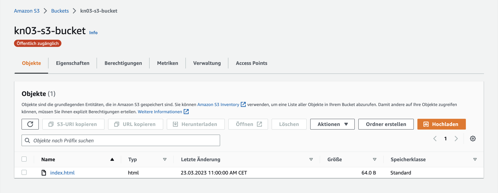

### Die Webseite testen

Nun müssen noch die Einstellungen für das Hosting der Webseite geändert werden. Dazu muss der Reiter "Eigenschaften" ausgewählt werden. Unter dem Punkt "Statische Website Hosting" muss der Haken bei "Statische Website Hosting aktivieren" gesetzt werden. Als Index Document muss "index.html" angegeben werden. Nachdem die Einstellungen gespeichert wurden, sollte der Bucket-Website-Endpunkt angezeigt werden.

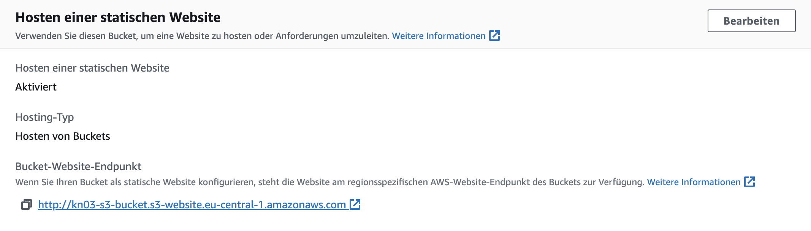

Der Bucket-Website-Endpunkt kann nun aufgerufen werden. Die Webseite sollte nun angezeigt werden. Die Webseite beinhaltet lediglich eine kurze Begrüßung: "Hello World. Take me to your leader.".

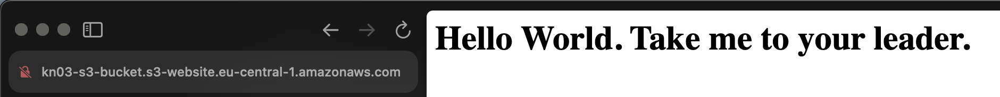

## Zugriff auf die Instanz über SSH

Um sich auf der Instanz anzumelden, muss zunächst das Key Pair erstellt und heruntergeladen werden. Hier wird das Key Pair "Jonathan-1" erstellt. Danach muss das Key Pair in das Verzeichnis ".ssh" verschoben werden.

Anschliessend müssen die Zugriffsrechte für den aktuellen Benutzer des Key Pairs mit dem Befehl `chmod 600 <Name>.pem` (Lesen & Schreiben) oder `chmod 400 <Name>.pem` (Nur Lesen) angepasst werden. Würde dieser Befehl nicht ausgeführt werden, dann würde der Private Key als unprotected gelten und der Zugriff auf die Instanz nicht möglich sein.

Jetzt kann sich auf der Instanz mit dem Befehl `ssh <user>@<server> -i <path-to-privatekey>\<private-key-file>.pem -o
ServerAliveInterval=30` angemeldet werden.

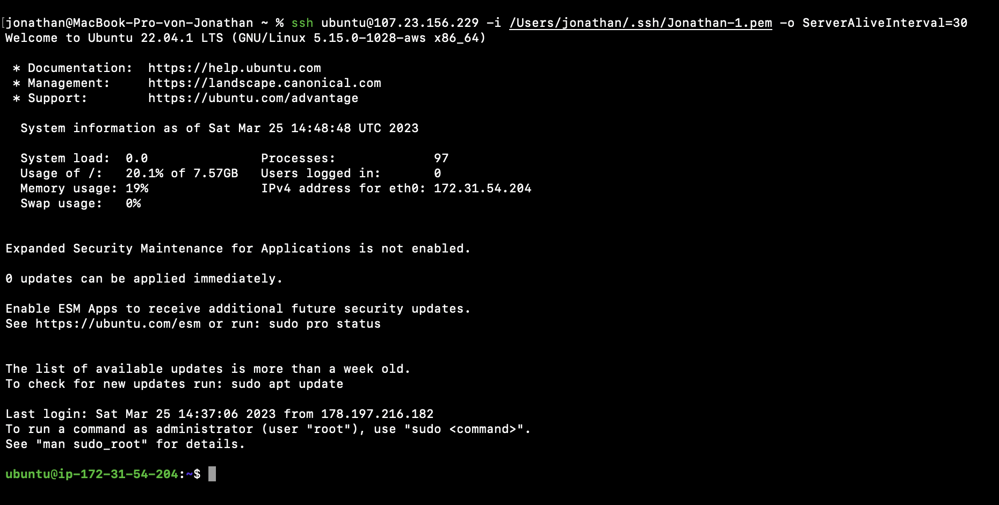

## SSH Key mit Cloud Init konfigurieren

Zuerst muss der Public Key vom Private Key extrahiert werden. Dazu kann puttygen verwendet werden. Der entsprechende Befehl lautet `puttygen "<path-to-privatekey>\<private-key-file>.pem" -L > "<public-key-file>.pub"`.

Nun wird eine neue Instanz erstellt und der zweite Schlüsssel via Eigenschaften im GUI ausgewählt. Danach wird der erste Public Key in das Cloud Init Textfeld kopiert. Das sollte wie folgt aussehen:

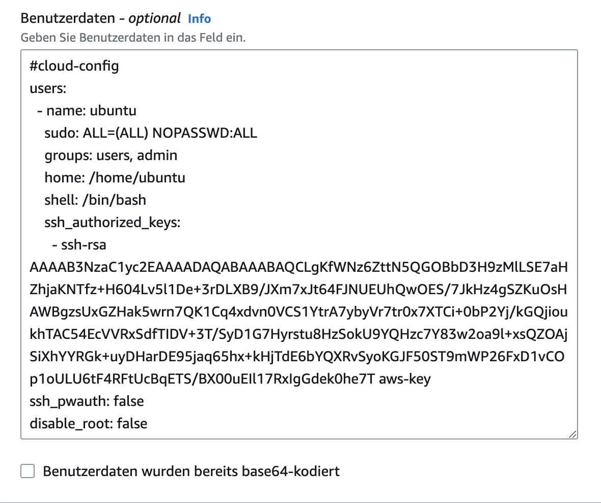

Jetzt kann sich wieder auf die Instanz via SSH angemeldet werden. Dafür wird der erste Private Key verwendet.

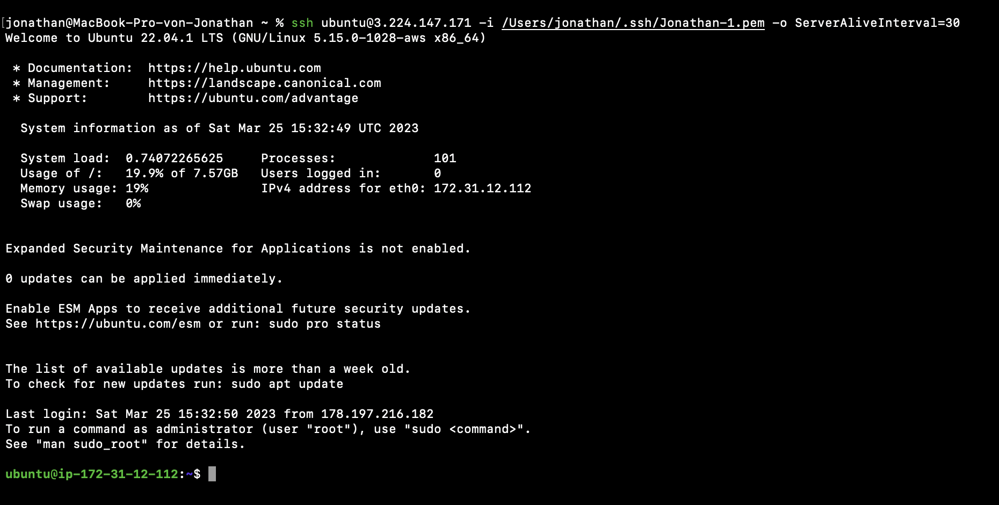
