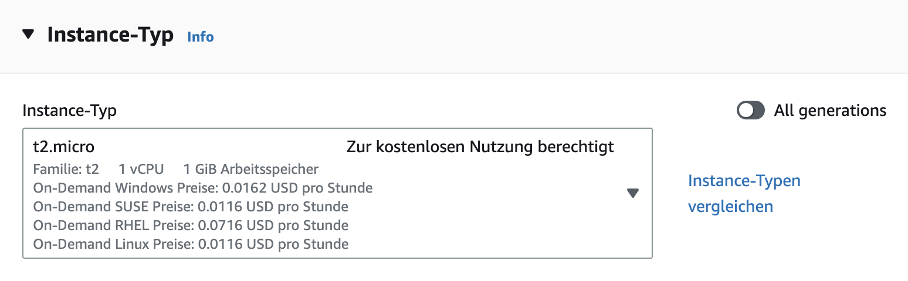
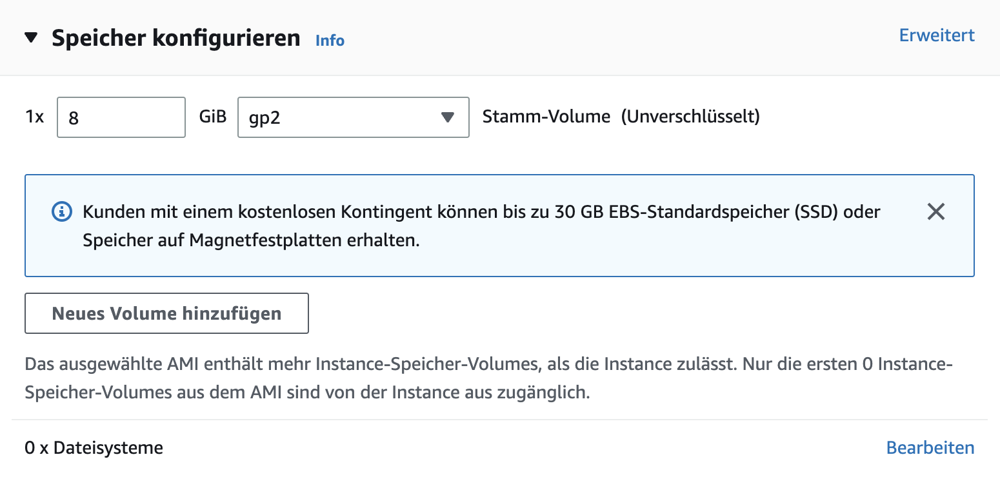
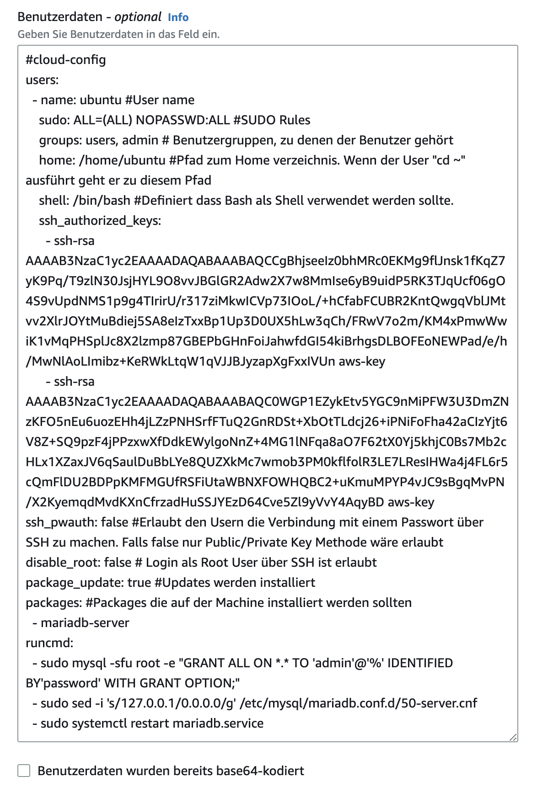
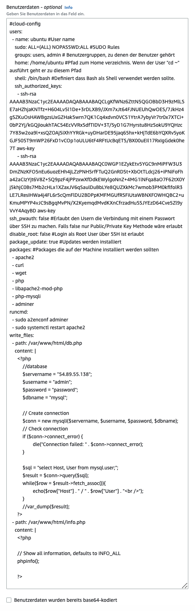
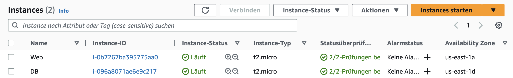
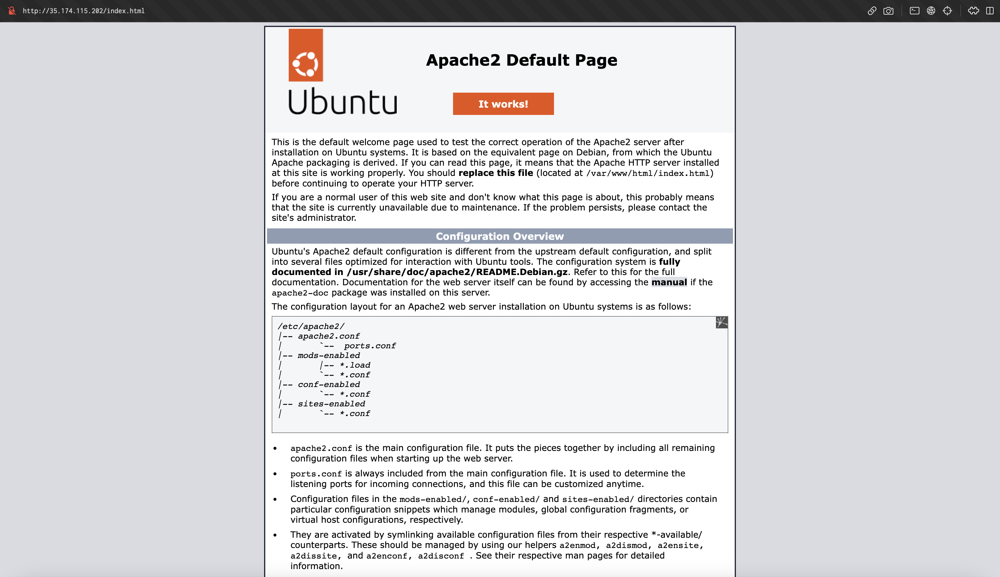
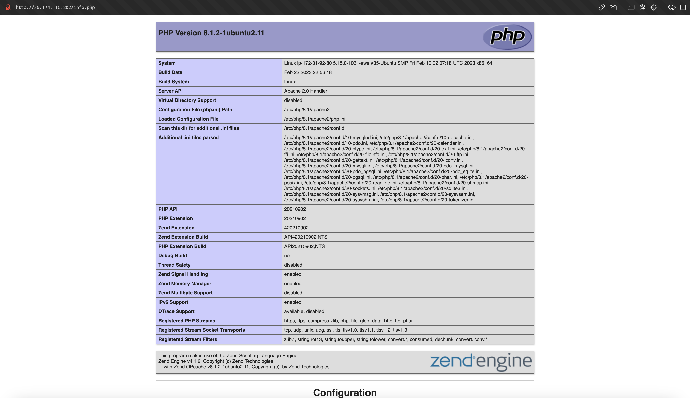
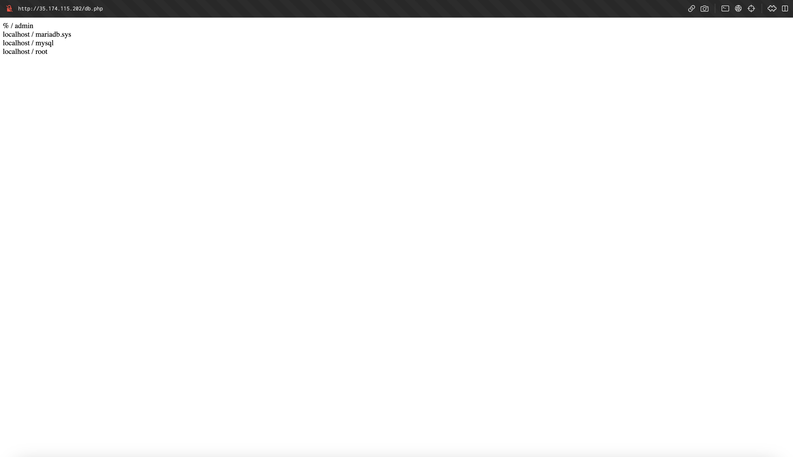
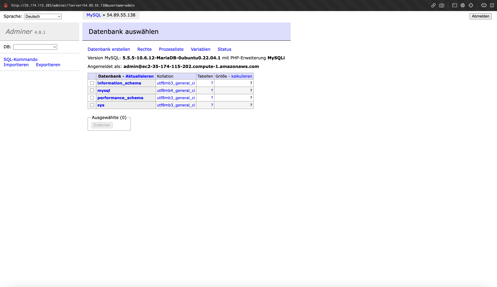

# KN04: Zugriff auf Instanz / Sicherheit

## Cloud Init

Es gibt zwei Cloud Init Dateien, die wir verwenden können. Für die erste Instanz `Web` wird die `cloud-init-web.yaml` Datei verwendet. Für die zweite Instanz `DB` wird die `cloud-init-db.yaml` Datei verwendet. Es ist wichtig die `DB` Instanz zuerst zu erstellen, da die `Web` Instanz darauf zugreifen muss und im entsprechenden cloud init file die IP Adresse der `DB` Instanz noch angepassst werden muss.

[cloud-init-db.yaml](cloud-init/cloud-init-db.yaml)

```yaml
#cloud-config
users:
  - name: ubuntu #User name
    sudo: ALL=(ALL) NOPASSWD:ALL #SUDO Rules
    groups: users, admin # Benutzergruppen, zu denen der Benutzer gehört
    home: /home/ubuntu #Pfad zum Home verzeichnis. Wenn der User "cd ~" ausführt geht er zu diesem Pfad
    shell: /bin/bash #Definiert dass Bash als Shell verwendet werden sollte.
    ssh_authorized_keys:
      - ssh-rsa AAAAB3NzaC1yc2EAAAADAQABAAABAQCCgBhjseeIz0bhMRc0EKMg9flJnsk1fKqZ7yK9Pq/T9zlN30JsjHYL9O8vvJBGlGR2Adw2X7w8MmIse6yB9uidP5RK3TJqUcf06gO4S9vUpdNMS1p9g4TIrirU/r317ziMkwICVp73IOoL/+hCfabFCUBR2KntQwgqVblJMtvv2XlrJOYtMuBdiej5SA8eIzTxxBp1Up3D0UX5hLw3qCh/FRwV7o2m/KM4xPmwWwiK1vMqPHSplJc8X2lzmp87GBEPbGHnFoiJahwfdGI54kiBrhgsDLBOFEoNEWPad/e/h/MwNlAoLImibz+KeRWkLtqW1qVJJBJyzapXgFxxIVUn aws-key
      - ssh-rsa AAAAB3NzaC1yc2EAAAADAQABAAABAQC0WGP1EZykEtv5YGC9nMiPFW3U3DmZNzKFO5nEu6uozEHh4jLZzPNHSrfFTuQ2GnRDSt+XbOtTLdcj26+iPNiFoFha42aCIzYjt6V8Z+SQ9pzF4jPPzxwXfDdkEWylgoNnZ+4MG1lNFqa8aO7F62tX0Yj5khjC0Bs7Mb2cHLx1XZaxJV6qSaulDuBbLYe8QUZXkMc7wmob3PM0kflfolR3LE7LResIHWa4j4FL6r5cQmFlDU2BDPpKMFMGUfRSFiUtaWBNXFOWHQBC2+uKmuMPYP4vJC9sBgqMvPN/X2KyemqdMvdKXnCfrzadHuSSJYEzD64Cve5Zl9yVvY4AqyBD aws-key
ssh_pwauth: false #Erlaubt den Usern die Verbindung mit einem Passwort über SSH zu machen. Falls false nur Public/Private Key Methode wäre erlaubt
disable_root: false # Login als Root User über SSH ist erlaubt
packages: #Packages die auf der Machine installiert werden sollten
  - mariadb-server
runcmd:
  - sudo mysql -sfu root -e "GRANT ALL ON *.* TO 'admin'@'%' IDENTIFIED BY'password' WITH GRANT OPTION;"
  - sudo sed -i 's/127.0.0.1/0.0.0.0/g' /etc/mysql/mariadb.conf.d/50-server.cnf
  - sudo systemctl restart mariadb.service
```

[cloud-init-web.yaml](cloud-init/cloud-init-web.yaml)

```yaml
#cloud-config
users:
  - name: ubuntu #User name
    sudo: ALL=(ALL) NOPASSWD:ALL #SUDO Rules
    groups: users, admin # Benutzergruppen, zu denen der Benutzer gehört
    home: /home/ubuntu #Pfad zum Home verzeichnis. Wenn der User "cd ~" ausführt geht er zu diesem Pfad
    shell: /bin/bash #Definiert dass Bash als Shell verwendet werden sollte.
    ssh_authorized_keys:
      - ssh-rsa AAAAB3NzaC1yc2EAAAADAQABAAABAQCLgKfWNz6ZttN5QGOBbD3H9zMlLSE7aHZhjaKNTfz+H604Lv5l1De+3rDLXB9/JXm7xJt64FJNUEUhQwOES/7JkHz4gSZKuOsHAWBgzsUxGZHak5wrn7QK1Cq4xdvn0VCS1YtrA7ybyVr7tr0x7XTCi+0bP2Yj/kGQjioukhTAC54EcVVRxSdfTIDV+3T/SyD1G7Hyrstu8HzSokU9YQHzc7Y83w2oa9l+xsQZOAjSiXhYYRGk+uyDHarDE95jaq65hx+kHjTdE6bYQXRvSyoKGJF50ST9mWP26FxD1vCOp1oULU6tF4RFtUcBqETS/BX00uEIl17RxIgGdek0he7T aws-key
      - ssh-rsa AAAAB3NzaC1yc2EAAAADAQABAAABAQC0WGP1EZykEtv5YGC9nMiPFW3U3DmZNzKFO5nEu6uozEHh4jLZzPNHSrfFTuQ2GnRDSt+XbOtTLdcj26+iPNiFoFha42aCIzYjt6V8Z+SQ9pzF4jPPzxwXfDdkEWylgoNnZ+4MG1lNFqa8aO7F62tX0Yj5khjC0Bs7Mb2cHLx1XZaxJV6qSaulDuBbLYe8QUZXkMc7wmob3PM0kflfolR3LE7LResIHWa4j4FL6r5cQmFlDU2BDPpKMFMGUfRSFiUtaWBNXFOWHQBC2+uKmuMPYP4vJC9sBgqMvPN/X2KyemqdMvdKXnCfrzadHuSSJYEzD64Cve5Zl9yVvY4AqyBD aws-key
ssh_pwauth: false #Erlaubt den Usern die Verbindung mit einem Passwort über SSH zu machen. Falls false nur Public/Private Key Methode wäre erlaubt
disable_root: false # Login als Root User über SSH ist erlaubt
packages: #Packages die auf der Machine installiert werden sollten
  - apache2
  - curl
  - wget
  - php
  - libapache2-mod-php
  - php-mysqli
  - adminer
runcmd:
  - sudo a2enconf adminer
  - sudo systemctl restart apache2
write_files:
  - path: /var/www/html/db.php
    content: |
      <?php
          //database
          $servername = "3.93.82.79";
          $username = "admin";
          $password = "password";
          $dbname = "mysql";

          // Create connection
          $conn = new mysqli($servername, $username, $password, $dbname);
          // Check connection
          if ($conn->connect_error) {
                  die("Connection failed: " . $conn->connect_error);
          }

          $sql = "select Host, User from mysql.user;";
          $result = $conn->query($sql);
          while($row = $result->fetch_assoc()){
                  echo($row["Host"] . " / " . $row["User"] . "<br />");
          }
          //var_dump($result);
      ?>
  - path: /var/www/html/info.php
    content: |
      <?php

      // Show all information, defaults to INFO_ALL
      phpinfo();

      ?>
```

## Erstellen der Instanzen

Jetzt müssen wir die beiden Instanzen erstellen. Die wichtigsten Einstellungen sehen dabei wie folgt aus.

### DB Instanz

Der Instanz-Typ wird auf `t2.micro` gesetzt. Das ist der Standardwert.



Der Speicher wird auf `8 GB` gesetzt. Auch hier ist das der Standardwert.



Nun kann der Inhalt der `cloud-init-db.yaml` Datei in das Feld `Benutzerdaten` kopiert werden. Damit wird die Instanz mit den entsprechenden Einstellungen konfiguriert.



### Web Instanz

Nachdem die DB Instanz erstellt wurde, kann die Web Instanz nun erstellt werden.

Der Instanz-Typ wird auf `t2.micro` gesetzt. Das ist der Standardwert.


Der Speicher wird auf `8 GB` gesetzt. Auch hier ist das der Standardwert.


Nun kann der Inhalt der `cloud-init-db.yaml` Datei in das Feld `Benutzerdaten` kopiert werden. Damit wird die Instanz mit den entsprechenden Einstellungen konfiguriert.



### Instanzen



### Browser Seiten

#### Index HTML



#### Info PHP



#### DB PHP



#### Adminer


