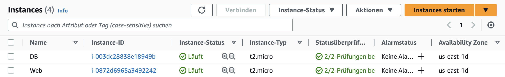
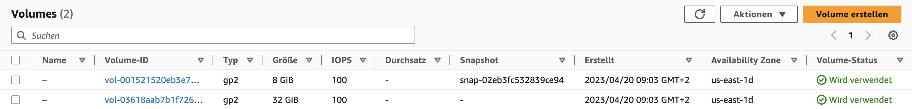
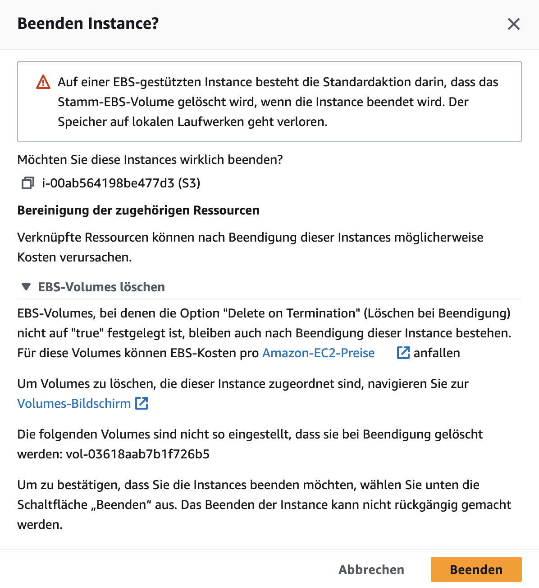
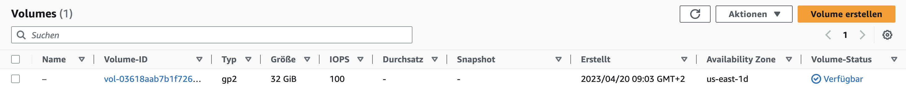

# KN04: Zugriff auf Instanz / Sicherheit

## Cloud Init

Es gibt zwei Cloud Init Dateien, die wir verwenden können. Für die erste Instanz `Web` wird die `cloud-init-web.yaml` Datei verwendet. Für die zweite Instanz `DB` wird die `cloud-init-db.yaml` Datei verwendet. Es ist wichtig die `DB` Instanz zuerst zu erstellen, da die `Web` Instanz darauf zugreifen muss und im entsprechenden cloud init file die IP Adresse der `DB` Instanz noch angepassst werden muss.

[cloud-init-db.yaml](cloud-init/cloud-init-db.yaml)

```yaml
#cloud-config
users:
  - name: ubuntu #User name
    sudo: ALL=(ALL) NOPASSWD:ALL #SUDO Rules
    groups: users, admin # Benutzergruppen, zu denen der Benutzer gehört
    home: /home/ubuntu #Pfad zum Home verzeichnis. Wenn der User "cd ~" ausführt geht er zu diesem Pfad
    shell: /bin/bash #Definiert dass Bash als Shell verwendet werden sollte.
    ssh_authorized_keys: #SSH Public Keys
      - ssh-rsa AAAAB3NzaC1yc2EAAAADAQABAAABAQCCgBhjseeIz0bhMRc0EKMg9flJnsk1fKqZ7yK9Pq/T9zlN30JsjHYL9O8vvJBGlGR2Adw2X7w8MmIse6yB9uidP5RK3TJqUcf06gO4S9vUpdNMS1p9g4TIrirU/r317ziMkwICVp73IOoL/+hCfabFCUBR2KntQwgqVblJMtvv2XlrJOYtMuBdiej5SA8eIzTxxBp1Up3D0UX5hLw3qCh/FRwV7o2m/KM4xPmwWwiK1vMqPHSplJc8X2lzmp87GBEPbGHnFoiJahwfdGI54kiBrhgsDLBOFEoNEWPad/e/h/MwNlAoLImibz+KeRWkLtqW1qVJJBJyzapXgFxxIVUn aws-key
      - ssh-rsa AAAAB3NzaC1yc2EAAAADAQABAAABAQC0WGP1EZykEtv5YGC9nMiPFW3U3DmZNzKFO5nEu6uozEHh4jLZzPNHSrfFTuQ2GnRDSt+XbOtTLdcj26+iPNiFoFha42aCIzYjt6V8Z+SQ9pzF4jPPzxwXfDdkEWylgoNnZ+4MG1lNFqa8aO7F62tX0Yj5khjC0Bs7Mb2cHLx1XZaxJV6qSaulDuBbLYe8QUZXkMc7wmob3PM0kflfolR3LE7LResIHWa4j4FL6r5cQmFlDU2BDPpKMFMGUfRSFiUtaWBNXFOWHQBC2+uKmuMPYP4vJC9sBgqMvPN/X2KyemqdMvdKXnCfrzadHuSSJYEzD64Cve5Zl9yVvY4AqyBD aws-key
ssh_pwauth: false #Erlaubt den Usern die Verbindung mit einem Passwort über SSH zu machen. Falls false nur Public/Private Key Methode wäre erlaubt
disable_root: false # Login als Root User über SSH ist erlaubt
packages: #Packages die auf der Machine installiert werden sollten
  - mariadb-server
runcmd: #Befehle die nach dem Start der VM ausgeführt werden sollen
  - sudo mysql -sfu root -e "GRANT ALL ON *.* TO 'admin'@'%' IDENTIFIED BY'password' WITH GRANT OPTION;"
  - sudo sed -i 's/127.0.0.1/0.0.0.0/g' /etc/mysql/mariadb.conf.d/50-server.cnf
  - sudo systemctl restart mariadb.service
```

[cloud-init-web.yaml](cloud-init/cloud-init-web.yaml)

```yaml
#cloud-config
users: #User die auf der VM erstellt werden sollen
  - name: ubuntu #User name
    sudo: ALL=(ALL) NOPASSWD:ALL #SUDO Rules
    groups: users, admin # Benutzergruppen, zu denen der Benutzer gehört
    home: /home/ubuntu #Pfad zum Home verzeichnis. Wenn der User "cd ~" ausführt geht er zu diesem Pfad
    shell: /bin/bash #Definiert dass Bash als Shell verwendet werden sollte.
    ssh_authorized_keys:
      - ssh-rsa AAAAB3NzaC1yc2EAAAADAQABAAABAQCLgKfWNz6ZttN5QGOBbD3H9zMlLSE7aHZhjaKNTfz+H604Lv5l1De+3rDLXB9/JXm7xJt64FJNUEUhQwOES/7JkHz4gSZKuOsHAWBgzsUxGZHak5wrn7QK1Cq4xdvn0VCS1YtrA7ybyVr7tr0x7XTCi+0bP2Yj/kGQjioukhTAC54EcVVRxSdfTIDV+3T/SyD1G7Hyrstu8HzSokU9YQHzc7Y83w2oa9l+xsQZOAjSiXhYYRGk+uyDHarDE95jaq65hx+kHjTdE6bYQXRvSyoKGJF50ST9mWP26FxD1vCOp1oULU6tF4RFtUcBqETS/BX00uEIl17RxIgGdek0he7T aws-key
      - ssh-rsa AAAAB3NzaC1yc2EAAAADAQABAAABAQC0WGP1EZykEtv5YGC9nMiPFW3U3DmZNzKFO5nEu6uozEHh4jLZzPNHSrfFTuQ2GnRDSt+XbOtTLdcj26+iPNiFoFha42aCIzYjt6V8Z+SQ9pzF4jPPzxwXfDdkEWylgoNnZ+4MG1lNFqa8aO7F62tX0Yj5khjC0Bs7Mb2cHLx1XZaxJV6qSaulDuBbLYe8QUZXkMc7wmob3PM0kflfolR3LE7LResIHWa4j4FL6r5cQmFlDU2BDPpKMFMGUfRSFiUtaWBNXFOWHQBC2+uKmuMPYP4vJC9sBgqMvPN/X2KyemqdMvdKXnCfrzadHuSSJYEzD64Cve5Zl9yVvY4AqyBD aws-key
ssh_pwauth: false #Erlaubt den Usern die Verbindung mit einem Passwort über SSH zu machen. Falls false nur Public/Private Key Methode wäre erlaubt
disable_root: false # Login als Root User über SSH ist erlaubt
packages: #Packages die auf der Machine installiert werden sollten
  - apache2
  - curl
  - wget
  - php
  - libapache2-mod-php
  - php-mysqli
  - adminer
runcmd: #Befehle die nach dem Start der VM ausgeführt werden sollen
  - sudo a2enconf adminer
  - sudo systemctl restart apache2
write_files: #Dateien die auf der VM erstellt werden sollen
  - path: /var/www/html/db.php
    content: |
      <?php
          //database
          $servername = "3.93.82.79";
          $username = "admin";
          $password = "password";
          $dbname = "mysql";

          // Create connection
          $conn = new mysqli($servername, $username, $password, $dbname);
          // Check connection
          if ($conn->connect_error) {
                  die("Connection failed: " . $conn->connect_error);
          }

          $sql = "select Host, User from mysql.user;";
          $result = $conn->query($sql);
          while($row = $result->fetch_assoc()){
                  echo($row["Host"] . " / " . $row["User"] . "<br />");
          }
          //var_dump($result);
      ?>
  - path: /var/www/html/info.php
    content: |
      <?php

      // Show all information, defaults to INFO_ALL
      phpinfo();

      ?>
```

## Erstellen der Instanzen

Jetzt müssen wir die beiden Instanzen erstellen. Die wichtigsten Einstellungen sehen dabei wie folgt aus.

### DB Instanz

Der Instanz-Typ wird auf `t2.micro` gesetzt. Das ist der Standardwert.


Der Speicher wird auf `8 GB` gesetzt. Auch hier ist das der Standardwert.


Nun kann der Inhalt der `cloud-init-db.yaml` Datei in das Feld `Benutzerdaten` kopiert werden. Damit wird die Instanz mit den entsprechenden Einstellungen konfiguriert. Davor sollte aber noch überprüft werden, ob auch die IP Adresse der DB Instanz korrekt eingetragen wurde.


### Web Instanz

Nachdem die DB Instanz erstellt wurde, kann die Web Instanz nun erstellt werden.

Der Instanz-Typ wird auch hier wieder auf den Standardwert `t2.micro` gesetzt.


Der Speicher wird ebenso auf den Standardwert `8 GB` gesetzt.


Jetzt kann wieder der Inhalt der `cloud-init-web.yaml` Datei in das Feld `Benutzerdaten` kopiert werden. Damit wird die Instanz mit den entsprechenden Einstellungen konfiguriert.




## Testen der Instanzen

Nun können die beiden Instanzen getestet werden. Dazu wird die IP Adresse der Web Instanz in den Browser eingegeben. In diesem Fall ist das `35.174.115.202`.

Es sollte nun die `Apache 2 Default Page` angezeigt werden. Sie kann ebenfalls über die Route `/index.html` aufgerufen werden können.


Die Route `/info.php` zeigt die PHP Info Seite an.


Wenn die Anfrage über die Route `/db.php` erfolgreich war, bedeutet das, dass die beiden Instanzen miteinander kommunizieren können.


Über Adminer kann nun auch die Datenbankverwaltung getestet werden. Die dazugehörige Route ist `/adminer`. Jetzt müssen noch die entsprechenden Datenbank-Verbindungsdaten eingegeben werden. Diese sind in der `cloud-init-db.yaml` Datei zu finden. Nachdem das Login erfolgreich war, sollte die Datenbankverwaltung angezeigt werden.


## Speicher

`a) Welchem Speichermodell wird S3 zugeordnet? Begründen Sie ihre Antwort.`

S3 wird dem Object Storage-Modell zugeordnet, da das Object Storage Daten als Objekte speichert, die über ein eindeutiges Identifier und Metadaten abgerufen werden können. Es eignet sich besonders für unstrukturierte Daten wie Bilder, Videos, Backups und Log-Dateien.

`b) Wenn Sie eine EC2-Instanz erstellen, fügen Sie auch Speicher hinzu. Es handelt sich hierbei um einen Hot Storage, welcher in AWS Elastic Block Storage (EBS) genannt wird.`

Nachdem das neu erstellte Volume an die bereits bestehende Instanz angehängt wurde, sollte die Liste der Volumes wie folgt aussehen.



Wenn jetzt versucht wird die Instanz mit diesem Volume zu löschen, wird folgende Bestätigungsmeldung angezeigt.



Sie sagt aus, dass das Stamm-EBS-Volume gelöscht wird, wenn die Instanz beendet wird, und der Speicher auf lokalen Laufwerken verloren geht. In diesem Fall handelt es sich um flüchtigen Speicher, da die Daten nicht erhalten bleiben, wenn die Instanz gelöscht wird.

Nach dem Aufklappen des Dropdowns kommt noch eine weitere Meldung zum Vorschein. Diese sagt, dass EBS-Volumes, bei denen die Option "Delete on Termination" nicht auf "true" festgelegt ist, auch nach Beendigung der Instanz bestehen bleiben. Das ist dann wiederum um ein Beispiel von persistenten Speicher, da die Daten auf dem Volume erhalten bleiben, selbst wenn die Instanz gelöscht wird.

Da diese Option bei der zuvor erstellten Instanz nicht aktiviert ist, wird das manuell erstellte Volume nach dem Löschen der Instanz nicht gelöscht.



Ein Szenario, in dem dieses Verhalten sinnvoll ist, wäre zum Beispiel, wenn man eine Datenbank einer Applikation hat. Bei dieser wäre es sehr kritisch wenn z.B. wichtige Kundendaten nach dem löschen der Instanz weg wären.
