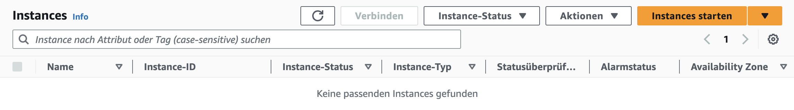
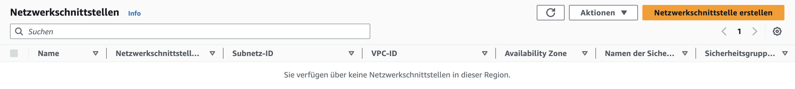

# KN05: Netzwerk / Sicherheit

## Vorbereitung

Zuerst sollten alle Instanzen terminiert werden



Nun müssen alle Netzwerkschnittstellen gelöscht werden



Als nächstes müssen alle Sicherheitsgruppen ausser die Standardgruppe gelöscht werden


Zum Schluss müssen noch die verbleibenden Subnetze gelöscht werden. Die VPC soll aber bestehen bleiben.


## Netzwerk und Sicherheit Einrichten

### Subnetz

Als erstes muss ein Subnetz erstellt werden. Hierfür wählen wir zuerst den bestehenden Standard-VPC aus. Danach muss der IPv4-CIDR-Block auf `172.31.10.0/24` gesetzt werden, damit das Subnetz von `172.31.10.0 - 172.31.10.255` reicht.
Nachdem das Subnetz erstellt wurde, muss ausserdem noch die Option "Enable auto-assign public IPv4 address" aktiviert werden, da wir sonst keine öffentliche IP-Adresse erhalten.


### Sicherheitsgruppen

Nun müssen wir die Sicherheitsgruppen erstellen. Wir erstellen eine Gruppe für den Webserver und eine für den Datenbankserver.

Für den Webserver muss hier beim Typ in den Inbound Rules HTTP und SSH ausgewählt werden, damit die beiden Ports 3306 und 22 offen sind.


In den Inbound Rules des Datenbankservers muss wiederum MYSQL/Aurora und SSH für den Typ ausgewählt werden, damit die beiden Ports 80 und 22 offen sind.


### Elastic IPs

Als nächstes müssen zwei Elastic IPs erstellt werden. Die Elastic IPs sind dafür da, dass die Instanzen später eine statische öffentliche IP-Adresse erhalten.


### Network Interfaces

Jetzt können noch zwei Network Interfaces erstellt werden. Wir erstellen wieder eins für den Webserver und eins für den Datenbankserver.

Beim Webserver muss das Subnetz ausgewählt werden, welches wir vorhin erstellt haben. Ausserdem muss die Web-Sicherheitsgruppe ausgewählt werden.


Beim Datenbankserver muss ebenfalls das Subnetz ausgewählt werden, welches wir vorhin erstellt haben. Ausserdem muss die Datenbank-Sicherheitsgruppe ausgewählt werden.


### Cloud-Init

Nun müssen die beiden Cloud-Init Dateien angepasst werden.

Bei der cloud-init-web.yaml Datei muss die IP-Adresse des Datenbankservers angepasst werden.

[cloud-init-web.yaml](cloud-init/cloud-init-web.yaml)

```yaml
#cloud-config
users: #User die auf der VM erstellt werden sollen
  - name: ubuntu #User name
    sudo: ALL=(ALL) NOPASSWD:ALL #SUDO Rules
    groups: users, admin # Benutzergruppen, zu denen der Benutzer gehört
    home: /home/ubuntu #Pfad zum Home verzeichnis. Wenn der User "cd ~" ausführt geht er zu diesem Pfad
    shell: /bin/bash #Definiert dass Bash als Shell verwendet werden sollte.
    ssh_authorized_keys: #SSH Public Keys
      - ssh-rsa AAAAB3NzaC1yc2EAAAADAQABAAABAQCLgKfWNz6ZttN5QGOBbD3H9zMlLSE7aHZhjaKNTfz+H604Lv5l1De+3rDLXB9/JXm7xJt64FJNUEUhQwOES/7JkHz4gSZKuOsHAWBgzsUxGZHak5wrn7QK1Cq4xdvn0VCS1YtrA7ybyVr7tr0x7XTCi+0bP2Yj/kGQjioukhTAC54EcVVRxSdfTIDV+3T/SyD1G7Hyrstu8HzSokU9YQHzc7Y83w2oa9l+xsQZOAjSiXhYYRGk+uyDHarDE95jaq65hx+kHjTdE6bYQXRvSyoKGJF50ST9mWP26FxD1vCOp1oULU6tF4RFtUcBqETS/BX00uEIl17RxIgGdek0he7T aws-key
      - ssh-rsa AAAAB3NzaC1yc2EAAAADAQABAAABAQC0WGP1EZykEtv5YGC9nMiPFW3U3DmZNzKFO5nEu6uozEHh4jLZzPNHSrfFTuQ2GnRDSt+XbOtTLdcj26+iPNiFoFha42aCIzYjt6V8Z+SQ9pzF4jPPzxwXfDdkEWylgoNnZ+4MG1lNFqa8aO7F62tX0Yj5khjC0Bs7Mb2cHLx1XZaxJV6qSaulDuBbLYe8QUZXkMc7wmob3PM0kflfolR3LE7LResIHWa4j4FL6r5cQmFlDU2BDPpKMFMGUfRSFiUtaWBNXFOWHQBC2+uKmuMPYP4vJC9sBgqMvPN/X2KyemqdMvdKXnCfrzadHuSSJYEzD64Cve5Zl9yVvY4AqyBD aws-key
ssh_pwauth: false #Erlaubt den Usern die Verbindung mit einem Passwort über SSH zu machen. Falls false nur Public/Private Key Methode wäre erlaubt
disable_root: false #Login als Root User über SSH ist erlaubt
package_update: true #Updates werden installiert
packages: #Packages die auf der Machine installiert werden sollten
  - apache2
  - curl
  - wget
  - php
  - libapache2-mod-php
  - php-mysqli
  - adminer
runcmd: #Befehle die nach dem Start der VM ausgeführt werden sollen
  - sudo a2enconf adminer
  - sudo systemctl restart apache2
write_files: #Dateien die auf der VM erstellt werden sollen
  - path: /var/www/html/db.php
    content: |
      <?php
          //database
          $servername = "172.31.10.204";
          $username = "admin";
          $password = "password";
          $dbname = "mysql";

          // Create connection
          $conn = new mysqli($servername, $username, $password, $dbname);
          // Check connection
          if ($conn->connect_error) {
                  die("Connection failed: " . $conn->connect_error);
          }

          $sql = "select Host, User from mysql.user;";
          $result = $conn->query($sql);
          while($row = $result->fetch_assoc()){
                  echo($row["Host"] . " / " . $row["User"] . "<br />");
          }
          //var_dump($result);
      ?>
  - path: /var/www/html/info.php
    content: |
      <?php

      // Show all information, defaults to INFO_ALL
      phpinfo();

      ?>
```

Bei der cloud-init-db.yaml Datei müssen zwei neue Befehele hinzugefügt werden. Der erste Befehl ersetzt die Limitierung des Pakets auf die lokale IP. Der zweite startet den Service neu.

```bash
sudo sed -i 's/127.0.0.1/0.0.0.0/g' /etc/mysql/mariadb.conf.d/50-server.cnf
sudo systemctl restart mariadb.service
```

[cloud-init-db.yaml](cloud-init/cloud-init-db.yaml)

```yaml
#cloud-config
users: #User die auf der VM erstellt werden sollen
  - name: ubuntu #User name
    sudo: ALL=(ALL) NOPASSWD:ALL #SUDO Rules
    groups: users, admin # Benutzergruppen, zu denen der Benutzer gehört
    home: /home/ubuntu #Pfad zum Home verzeichnis. Wenn der User "cd ~" ausführt geht er zu diesem Pfad
    shell: /bin/bash #Definiert dass Bash als Shell verwendet werden sollte.
    ssh_authorized_keys: #SSH Public Keys
      - ssh-rsa AAAAB3NzaC1yc2EAAAADAQABAAABAQCCgBhjseeIz0bhMRc0EKMg9flJnsk1fKqZ7yK9Pq/T9zlN30JsjHYL9O8vvJBGlGR2Adw2X7w8MmIse6yB9uidP5RK3TJqUcf06gO4S9vUpdNMS1p9g4TIrirU/r317ziMkwICVp73IOoL/+hCfabFCUBR2KntQwgqVblJMtvv2XlrJOYtMuBdiej5SA8eIzTxxBp1Up3D0UX5hLw3qCh/FRwV7o2m/KM4xPmwWwiK1vMqPHSplJc8X2lzmp87GBEPbGHnFoiJahwfdGI54kiBrhgsDLBOFEoNEWPad/e/h/MwNlAoLImibz+KeRWkLtqW1qVJJBJyzapXgFxxIVUn aws-key
      - ssh-rsa AAAAB3NzaC1yc2EAAAADAQABAAABAQC0WGP1EZykEtv5YGC9nMiPFW3U3DmZNzKFO5nEu6uozEHh4jLZzPNHSrfFTuQ2GnRDSt+XbOtTLdcj26+iPNiFoFha42aCIzYjt6V8Z+SQ9pzF4jPPzxwXfDdkEWylgoNnZ+4MG1lNFqa8aO7F62tX0Yj5khjC0Bs7Mb2cHLx1XZaxJV6qSaulDuBbLYe8QUZXkMc7wmob3PM0kflfolR3LE7LResIHWa4j4FL6r5cQmFlDU2BDPpKMFMGUfRSFiUtaWBNXFOWHQBC2+uKmuMPYP4vJC9sBgqMvPN/X2KyemqdMvdKXnCfrzadHuSSJYEzD64Cve5Zl9yVvY4AqyBD aws-key
ssh_pwauth: false #Erlaubt den Usern die Verbindung mit einem Passwort über SSH zu machen. Falls false nur Public/Private Key Methode wäre erlaubt
disable_root: false #Login als Root User über SSH ist erlaubt
package_update: true #Updates werden installiert
packages: #Packages die auf der Machine installiert werden sollten
  - mariadb-server
runcmd: #Befehle die nach dem Start der VM ausgeführt werden sollen
  - sudo mysql -sfu root -e "GRANT ALL ON *.* TO 'admin'@'%' IDENTIFIED BY'password' WITH GRANT OPTION;"
  - sudo sed -i 's/127.0.0.1/0.0.0.0/g' /etc/mysql/mariadb.conf.d/50-server.cnf
  - sudo systemctl restart mariadb.service
```

### Erstellen der Instanzen

Nachdem die beiden Cloud-Init Datein angepasst wurden, können die beiden Instanzen nun erstellt werden.

Hierfür bearbeiten wir die Netzwerkeinstellungen der beiden Instanzen und wählen zuerst bei "Öffentliche IP automatisch zuweisen" die Option "Deaktivieren aus". Danach wählen wir bei den Sicherheitsgruppen jeweils die dazugehörige Sicherheitsgruppe aus, die wir bereits erstellt haben. Zum Schluss muss noch die passende Netzwerkschnittstelle unter der Erweiterten Netzwerkkonfiguration ausgewählt werden.

#### Web Instanz


#### DB Instanz


Jetzt fehlen nur noch die jeweiligen Cloud-Init Dateien im Feld "User Data".

### Testen der Instanzen

Nun können die beiden Instanzen getestet werden. Dazu wird die IP Adresse der Web Instanz in den Browser eingegeben. In diesem Fall ist das `52.207.103.22`.

Es sollte nun die `Apache 2 Default Page` angezeigt werden. Sie kann ebenfalls über die Route `/index.html` aufgerufen werden können.


Die Route `/info.php` zeigt die PHP Info Seite an.


Wenn die Anfrage über die Route `/db.php` erfolgreich war, bedeutet das, dass die beiden Instanzen miteinander kommunizieren können.


